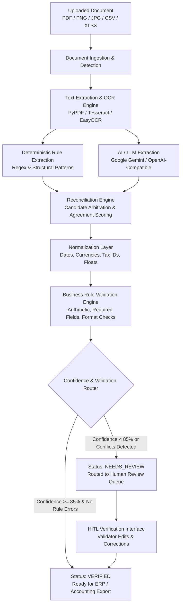

# Intelligent Document Processing (IDP) Platform

> An enterprise-grade Intelligent Document Processing (IDP) platform featuring hybrid multi-engine extraction (Deterministic Rules + Generative AI/LLM), automated candidate reconciliation, confidence-based validation routing, and Human-in-the-Loop (HITL) verification.

---

## 📑 Table of Contents

- [Overview](#-overview)
- [Architecture & Processing Pipeline](#-architecture--processing-pipeline)
- [Key Features](#-key-features)
- [Technology Stack](#-technology-stack)
- [Repository Structure](#-repository-structure)
- [Getting Started](#-getting-started)
  - [Prerequisites](#prerequisites)
  - [Backend Setup](#1-backend-setup-fastapi)
  - [Frontend Setup](#2-frontend-setup-react--vite)
- [Environment Configuration](#-environment-configuration)
- [AI / LLM Configuration](#-ai--llm-configuration)
- [API Reference](#-api-reference)
- [Testing & Quality Assurance](#-testing--quality-assurance)
- [Security & Privacy](#-security--privacy)
- [Collaboration & Contribution](#-collaboration--contribution)

---

## 🔍 Overview

The IDP platform automates the end-to-end extraction, validation, and reconciliation of critical business data from unstructured and semi-structured documents (PDFs, scanned invoices, receipts, images, CSVs, and Excel spreadsheets). 

Unlike pure-regex parsers or isolated LLM wrappers, this platform combines:
1. **Deterministic Rule Extraction**: High-speed, rule-based regular expressions and structural parsers.
2. **Generative LLM Intelligence**: Context-aware extraction powered by Google Gemini (or any OpenAI-compatible provider) following strict anti-injection prompt templates.
3. **Automated Reconciliation**: Multi-candidate arbitration that compares rule and AI outputs, scores agreement, flags discrepancies, and routes documents to automated approval (`VERIFIED`) or human review (`NEEDS_REVIEW`).

---

## 🏗 Architecture & Processing Pipeline



### Pipeline Stages

1. **Ingestion & Preprocessing**: Handles multi-page PDFs, raster images, spreadsheets, and CSVs. Detects file formats, rotates scanned images, and applies OCR preprocessing.
2. **Dual-Engine Extraction**:
   - **Rule Engine**: Evaluates regex patterns for invoice numbers, dates, currency, and line items.
   - **AI/LLM Engine**: Transmits sanitized document text to the configured LLM using structured JSON schemas and anti-injection system boundaries.
3. **Reconciliation Engine**: Merges candidate pools from both engines. Identifies corroborations (`AGREED`), entity refinements (`REFINED`), or discrepancies (`REVIEW REQUIRED`).
4. **Normalization & Validation**: Standardizes formats (`YYYY-MM-DD`, clean floating-point amounts) and runs integrity checks (e.g. `Total == Subtotal + Tax`).
5. **Confidence Routing**: Calculates field-level and overall confidence scores. Extractions meeting threshold criteria are automatically marked `VERIFIED`. Any discrepancies or low-confidence fields route the record to `NEEDS_REVIEW`.
6. **Human-in-the-Loop (HITL)**: Reviewers examine original files alongside extracted data, apply corrections, and verify the record, logging an immutable audit trail.

---

## ✨ Key Features

### 🖥 Enterprise React Dashboard
- **Live Processing Metrics**: Real-time KPI cards for *Total Processed*, *Total Verified*, *Needs Review*, and *Average Confidence*.
- **Document Archive & Filter Drawer**: Advanced filtering by status, document type, vendor, and invoice number with paginated tables.

### 🤖 AI / LLM Configuration Studio (`/settings/ai`)
- **One-Click Enable Toggle**: Instantly switch between *Rule + AI* and *Rule-Only* modes.
- **Provider & Model Selection**: Built-in support for Google Gemini (`gemini-1.5-flash`, `gemini-2.0-flash`, `gemini-1.5-pro`) and OpenAI-compatible endpoints (`gpt-4o-mini`, `gpt-4o`, `claude-3-5-sonnet`).
- **Zero-Leakage API Key Management**: API keys are securely transmitted to and stored on the backend. The frontend displays only masked indicators (`Configured ✓`).
- **Connection Diagnostic Tool**: Test live provider connectivity and measure request latency with non-technical diagnostic feedback.
- **Prompt Customization & Schema Selector**: Configure target schemas (`Invoice`, `Resume / CV`, `Student Document`, `General Document`, `Custom`) and preview compiled prompts with separate System Instructions and Document Content.
- **Collapsible Advanced Settings**: Configure request timeouts and character boundaries without cluttering the UI.

### 📄 Document Details & HITL Studio (`/documents/:id`)
- **Two-Panel Layout**:
  - **Left**: Embedded in-browser PDF iframe and high-resolution image viewer with download and new-tab links.
  - **Right**: Multi-tab extraction review panel (`Final Result`, `Rule Extraction`, `LLM Extraction`, `Comparison`, `Validation Rules`, `Audit History`).
- **Interactive Comparison**: Field-by-field verification with confidence meters and source badges (`RULE`, `AI`, `RULE + AI`, `HUMAN`).
- **Process with AI Button**: Re-run the extraction pipeline on-demand with real-time stepped progress feedback.
- **Direct Review & Verification**: Inline field editing, custom key-value additions, and single-click verification approval.

### 📋 Review Queue Triage (`/review`)
- Filtered queue of documents requiring validator confirmation.
- Direct modal viewer with side-by-side verification.

---

## 🛠 Technology Stack

### Backend
- **Framework**: Python 3.11+, [FastAPI](https://fastapi.tiangolo.com/)
- **Server**: [Uvicorn](https://www.uvicorn.org/)
- **ORM & Database**: [SQLAlchemy 2.0](https://www.sqlalchemy.org/), PostgreSQL / SQLite
- **Validation**: [Pydantic v2](https://docs.pydantic.dev/) & `pydantic-settings`
- **Document Processing**: `pypdf`, `pdfplumber`, `pdf2image`, `Pillow`, `openpyxl`, `pandas`
- **OCR Engine**: `pytesseract` (Tesseract OCR), OpenCV
- **Testing**: `pytest`, `httpx`

### Frontend
- **Framework**: [React 18 / 19](https://react.dev/), [Vite](https://vitejs.dev/)
- **Routing**: [React Router v6 / v7](https://reactrouter.com/)
- **Icons**: [Lucide React](https://lucide.dev/)
- **Styling**: Vanilla CSS Design System with enterprise design tokens (no heavy CSS framework dependencies)
- **API Client**: Native `fetch` wrapper with unified error handling and proxy support

---

## 📁 Repository Structure

```text
Intelligent Document Processing(IDP)/
├── backend/
│   ├── app/
│   │   ├── api/
│   │   │   └── routes/
│   │   │       ├── ai.py              # AI configuration, test connection, prompt preview
│   │   │       ├── dashboard.py       # KPI metrics & aggregate statistics
│   │   │       └── documents.py       # Ingestion, file streaming, verification, extraction
│   │   ├── core/
│   │   │   ├── ai_config.py           # Runtime AI configuration manager singleton
│   │   │   ├── config.py              # Application settings (Pydantic)
│   │   │   └── database.py            # SQLAlchemy database engine and session
│   │   ├── models/                    # Database models (DocumentRecord, etc.)
│   │   ├── schemas/                   # Pydantic request/response schemas
│   │   └── services/
│   │       ├── confidence_router.py   # Threshold routing logic (VERIFIED / NEEDS_REVIEW)
│   │       ├── llm_extractor.py       # Multi-provider LLM abstraction (Gemini, OpenAI, Mock)
│   │       ├── normalizer.py          # Value formatting (Dates, Currency, Numbers)
│   │       ├── ocr_engine.py          # Tesseract & image preprocessing
│   │       ├── pdf_parser.py          # Native text & tabular extraction
│   │       ├── processing_pipeline.py # Core orchestrator (Ingest -> OCR -> Extract -> Reconcile)
│   │       ├── reconciler.py          # Multi-candidate arbitration engine
│   │       └── validation_engine.py   # Business rule validation
│   ├── tests/                         # Complete test suite (374 unit & integration tests)
│   ├── requirements.txt               # Backend Python dependencies
│   └── .env.example                   # Sample environment configuration
│
├── frontend/
│   ├── src/
│   │   ├── api/                       # API client services (ai.js, documents.js, dashboard.js)
│   │   ├── components/
│   │   │   ├── ai/                    # AI components (AIStatusCard, AIConfigCard, PromptEditor, etc.)
│   │   │   ├── DocumentTable.jsx      # Enterprise paginated document table
│   │   │   ├── DocumentViewerModal.jsx# Verification modal
│   │   │   ├── Header.jsx             # Top bar with breadcrumbs and connection indicator
│   │   │   ├── Sidebar.jsx            # Collapsible navigation sidebar
│   │   │   ├── StatsCards.jsx         # KPI metric summary cards
│   │   │   ├── UploadModal.jsx        # Ingestion modal with Extraction Method selector
│   │   │   └── UploadView.jsx         # Full-page upload studio
│   │   ├── pages/
│   │   │   └── AISettings.jsx         # Clean AI & LLM Configuration page (/settings/ai)
│   │   ├── App.jsx                    # Application layout and routing
│   │   └── App.css                    # Complete enterprise stylesheet
│   ├── package.json                   # Frontend npm dependencies
│   └── vite.config.js                 # Vite configuration with API reverse proxy
│
├── .gitignore
└── README.md                          # Project documentation
```

---

## 🚀 Getting Started

### Prerequisites

- **Python**: 3.11 or higher
- **Node.js**: 18.x or higher (with `npm`)
- **Tesseract OCR** *(Optional for scanned image processing)*:
  - Windows: [UB-Mannheim Tesseract Installer](https://github.com/UB-Mannheim/tesseract/wiki)
  - Ubuntu/Debian: `sudo apt-get install tesseract-ocr`
  - macOS: `brew install tesseract`
- **Poppler** *(Optional for PDF page image rendering)*:
  - Windows: [Poppler for Windows](https://github.com/oschwartz10612/poppler-windows/releases)
  - Ubuntu/Debian: `sudo apt-get install poppler-utils`
  - macOS: `brew install poppler`

---

### 1. Backend Setup (FastAPI)

1. Open your terminal and navigate to the `backend` directory:
   ```bash
   cd backend
   ```

2. Create and activate a Python virtual environment:
   ```bash
   # Windows (PowerShell)
   python -m venv .venv
   .\.venv\Scripts\Activate.ps1

   # Linux / macOS
   python3 -m venv .venv
   source .venv/bin/activate
   ```

3. Install required Python packages:
   ```bash
   pip install --upgrade pip
   pip install -r requirements.txt
   ```

4. Configure your environment variables:
   ```bash
   cp .env.example .env
   ```
   *(Edit `.env` with your database credentials and optional Gemini API key. If no database is specified, SQLite will be used automatically).*

5. Start the FastAPI backend server:
   ```bash
   uvicorn app.main:app --host 127.0.0.1 --port 8000 --reload
   ```

The backend API will be available at `http://127.0.0.1:8000`. You can explore interactive Swagger documentation at `http://127.0.0.1:8000/docs`.

---

### 2. Frontend Setup (React + Vite)

1. Open a new terminal and navigate to the `frontend` directory:
   ```bash
   cd frontend
   ```

2. Install npm dependencies:
   ```bash
   npm install
   ```

3. Start the development server:
   ```bash
   npm run dev -- --host 127.0.0.1 --port 3000
   ```

4. Open your browser and navigate to:
   ```text
   http://127.0.0.1:3000
   ```

---

## ⚙️ Environment Configuration

The backend reads settings from `backend/.env`. Key parameters:

| Variable | Default | Description |
| :--- | :--- | :--- |
| `DATABASE_URL` | `sqlite:///./idp.db` | PostgreSQL or SQLite database connection URI |
| `AI_PROVIDER` | `gemini` | AI Provider (`gemini`, `openai_compatible`, `mock`, `noop`) |
| `AI_MODEL` | `gemini-1.5-flash` | Target LLM model identifier |
| `AI_API_KEY` | *(empty)* | Secret provider API key (e.g. Google Gemini API Key) |
| `AI_BASE_URL` | *(empty)* | Custom endpoint URL for OpenAI-compatible providers |
| `AI_TIMEOUT` | `30` | Network request timeout for LLM calls (in seconds) |
| `AI_MAX_INPUT_CHARACTERS` | `12000` | Maximum characters sent to the LLM to prevent overflows |
| `TESSERACT_CMD` | *(system path)* | Optional path to `tesseract.exe` (Windows) |
| `POPPLER_PATH` | *(system path)* | Optional path to Poppler binaries (Windows) |

---

## 🤖 AI / LLM Configuration

The platform supports runtime configuration via the UI without requiring server restarts:

1. Navigate to **AI / LLM** (`/settings/ai`) in the sidebar.
2. Select your provider (**Google Gemini** or **OpenAI-Compatible**).
3. Select or enter the model (e.g., `gemini-1.5-flash`, `gemini-2.0-flash`).
4. Enter your API key securely and click **Save Configuration**.
5. Click **Test Connection** to confirm live network connectivity with the provider.
6. Toggle **AI Extraction** to `ON` to enable hybrid Rule + AI extraction.
7. Under **Extraction Prompt**, customize the system prompt or target document schema (`Invoice`, `Resume`, `Student Document`, or `Custom`).

---

## 📡 API Reference

### Document Management & Processing
- `GET /api/documents`: List paginated documents with filtering (status, type, vendor, invoice number).
- `GET /api/documents/{id}`: Retrieve document details, field-level extraction data, and validation errors.
- `GET /api/documents/{id}/file`: Stream raw document file for in-browser PDF and image viewing.
- `POST /api/documents/upload`: Upload document (PDF, PNG, JPG, CSV, XLSX).
- `POST /api/documents/{id}/process`: Execute full ingestion pipeline.
- `POST /api/documents/{id}/verify`: Submit human validator field corrections (transitions record to `VERIFIED`).
- `GET /api/documents/review`: Retrieve triage queue of records needing review.
- `GET /api/documents/stats`: Get dashboard aggregate counts and confidence averages.

### AI / LLM Integration
- `GET /api/ai/config`: Retrieve current AI settings, masked key status, and available models. *(Never returns API keys).*
- `PUT /api/ai/config`: Update provider, model, enabled toggle, prompt override, or API key.
- `POST /api/ai/test-connection`: Execute lightweight diagnostic ping to verify LLM connection.
- `POST /api/ai/prompt/preview`: Compile multi-tier prompt preview for a document type.
- `GET /api/documents/{id}/extraction`: Retrieve multi-source extraction breakdown (Rule vs. LLM vs. Reconciled).
- `POST /api/documents/{id}/ai-extract`: Run multi-engine extraction on a document (`method=rule_plus_llm|llm|rule`).

---

## 🧪 Testing & Quality Assurance

### Backend Automated Test Suite
The backend contains 374 comprehensive unit and integration tests covering extraction, normalizers, OCR fallback, AI providers, reconciliation, confidence routing, and API endpoints:

```bash
cd backend
.\.venv\Scripts\pytest.exe -v
```

Expected output:
```text
======================= 374 passed in 5.70s =======================
```

### Frontend Production Build
Validate the client code and JSX bundle:

```bash
cd frontend
npm run build
```

Expected output:
```text
✓ built in ~600ms (0 errors)
```

---

## 🔒 Security & Privacy

1. **Server-Side Credential Isolation**: The Google Gemini API key is never bundled in frontend code, never stored in browser `localStorage`, and never sent in HTTP responses.
2. **Zero Client Secret Exposure**: GET endpoints return only `has_api_key: true` and `masked_api_key: "************configured"`.
3. **Anti-Injection Prompt Boundaries**: User document content is treated as untrusted data and isolated within clear delimiter boundaries (`--- START DOCUMENT ---` ... `--- END DOCUMENT ---`) to prevent instruction hijacking.
4. **Graceful Fallback**: If LLM services experience rate limits or network issues, the pipeline automatically falls back to deterministic rule extraction candidates without crashing or failing the document.

---

## 🤝 Collaboration & Contribution

1. Fork the repository and create a feature branch:
   ```bash
   git checkout -b feature/your-feature-name
   ```
2. Commit your changes with clear semantic commit messages:
   ```bash
   git commit -m "feat: add support for custom document schema export"
   ```
3. Ensure all backend tests pass (`pytest backend/tests/`) and the frontend builds cleanly (`npm run build`).
4. Push your branch to GitHub:
   ```bash
   git push origin feature/your-feature-name
   ```
5. Open a Pull Request detailing the changes and verification steps.

---

## 📄 License

This project is licensed under the MIT License. See the `LICENSE` file for details.
